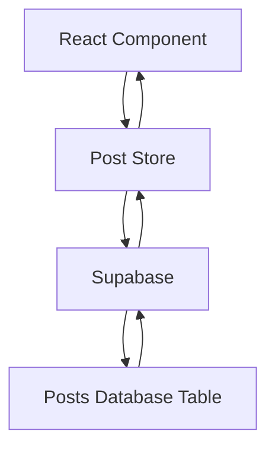
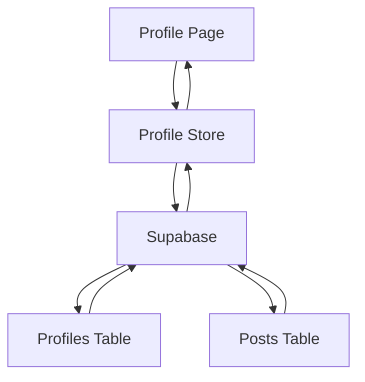
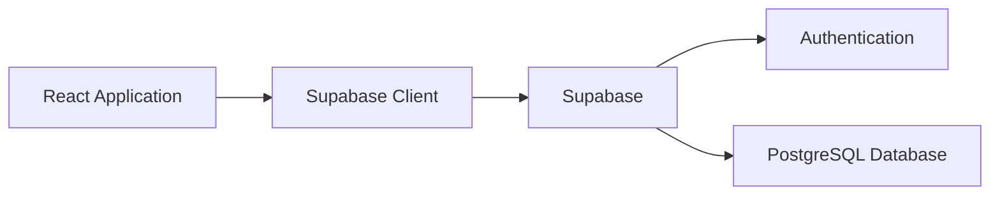
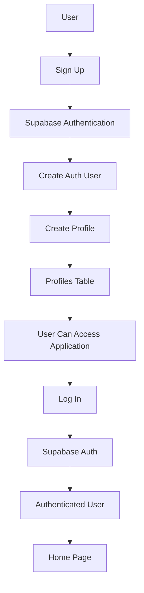
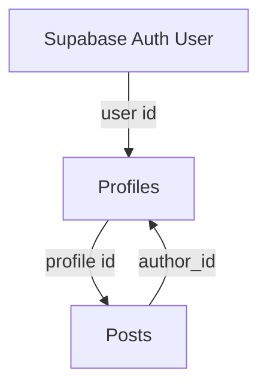
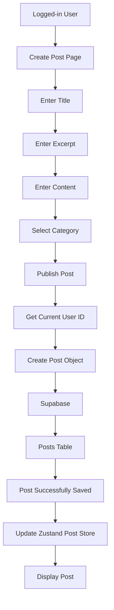
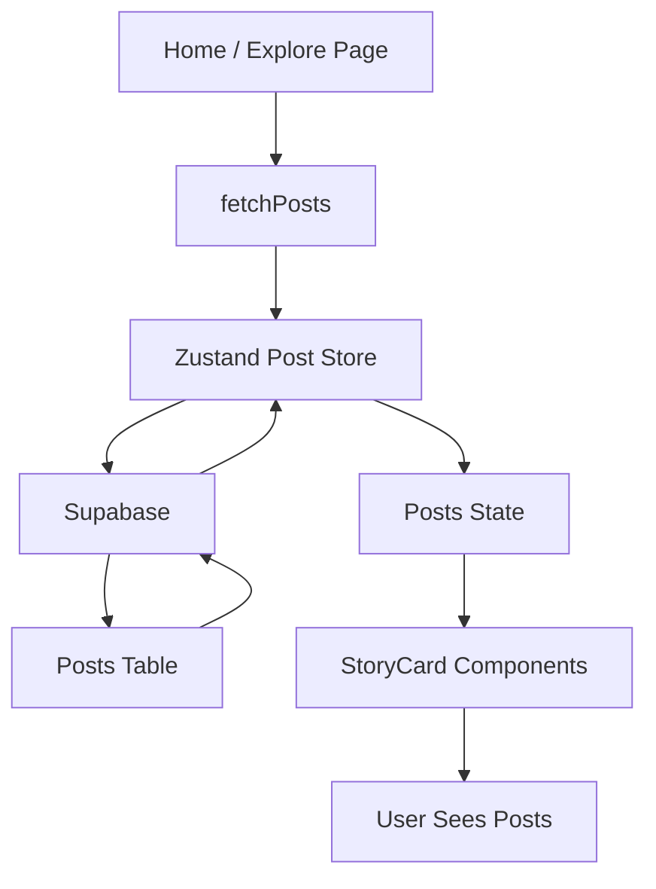
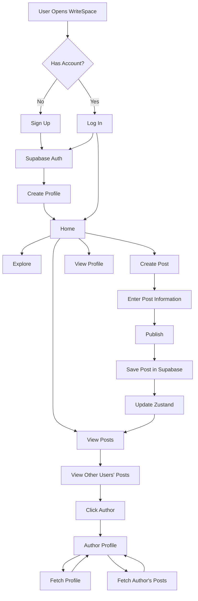
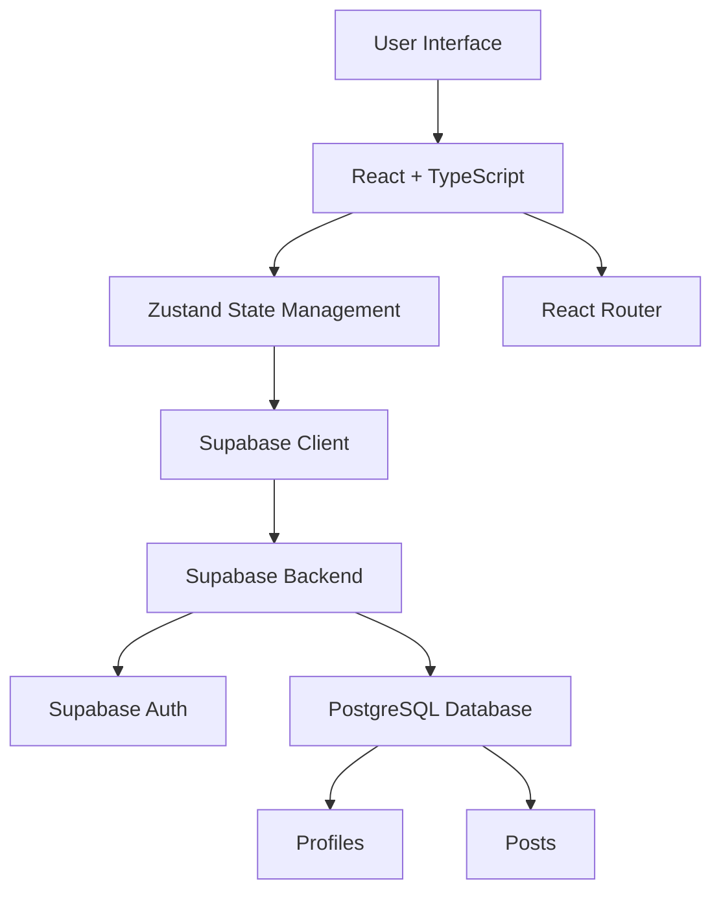
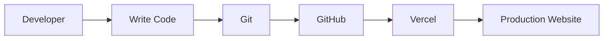

# WriteSpace — Project Documentation

## 1. Project Overview

WriteSpace is a multi-user blogging platform that allows users to create accounts, publish blog posts, explore posts created by other users, and view individual user profiles and their published posts.

The application is designed so that each user's posts are connected to their profile through their user ID.

---

# 2. Technologies Used

| Technology | Purpose |
|---|---|
| React | Used to build the application's user interface and reusable components. |
| TypeScript | Used to provide type safety and define the structure of application data. |
| Vite | Used as the development server and build tool for the React application. |
| Zustand | Used for global state management, including posts and profile data. |
| Supabase | Used as the backend service for authentication and database operations. |
| Supabase Auth | Used for user registration, login, and retrieving the current user. |
| React Router DOM | Used for navigation and dynamic routes between pages. |
| Font Awesome | Used for icons throughout the user interface. |
| CSS | Used to style the application and its components. |
| Git | Used for version control. |
| GitHub | Used to store and manage the project source code. |
| Vercel | Used to deploy and host the application. |

---

# 3. Frontend

The frontend of WriteSpace is built using React and TypeScript.

React is used to create reusable components such as:

- Navbar
- StoryCard
- FeaturedStory
- Explore
- CreatePost
- ProfilePage
- Login
- SignUp

TypeScript is used to define the types of data used by the application, including posts, profiles, forms, and component properties.

---

# 4. Vite

Vite is used as the development and build tool for the application.

It is responsible for:

- Running the application during development.
- Processing the React application.
- Creating the production build.
- Preparing the application for deployment.

The production build is deployed to Vercel.

---

# 5. Zustand

Zustand is used for state management.

Instead of keeping important application data inside individual components, Zustand stores shared data that can be accessed by different components.

## Post Store

The post store is responsible for:

- Fetching posts from Supabase.
- Creating new posts.
- Storing fetched posts.
- Updating the post state after a new post is created.

### Post Data Flow



## Profile Store

The profile store is responsible for:

- Fetching a user's profile.
- Fetching posts created by a specific user.
- Storing profile information.
- Storing the user's posts.

### Profile Data Flow



---

# 6. Supabase

Supabase is used as the backend of the application.

It provides:

- Authentication
- PostgreSQL database
- Database queries
- Row Level Security
- User management

The React application communicates with Supabase using the Supabase JavaScript client.



---

# 7. Authentication

Supabase Authentication is used to manage user accounts.

A user can:

1. Create an account.
2. Log in.
3. Become an authenticated user.
4. Create posts associated with their user ID.
5. Access their profile.

When a user signs up, their authentication account is created in Supabase Auth.

A profile record is also created in the `profiles` table.

### Authentication Flow



---

# 8. Database Structure

The application uses PostgreSQL through Supabase.

The main application tables are:

- `profiles`
- `posts`

## Profiles Table

The profiles table stores information about users.

Important fields include:

```text
id
username
display_name
email
avatar_url
bio
created_at
```

The `id` corresponds to the authenticated user's ID.

## Posts Table

The posts table stores blog posts.

Important fields include:

```text
id
created_at
author_id
title
slug
excerpt
content
cover_image
category
status
updated_at
```

The `author_id` identifies the user who created the post.

---

# 9. Database Relationship

The relationship between authentication, profiles, and posts is:



In simple terms:

```text
auth.users.id
      ↓
profiles.id
      ↓
posts.author_id
```

This relationship allows the application to know which user created each post.

---

# 10. Creating a Post

When a logged-in user creates a post, the application gets the current user's ID from Supabase Authentication.

The post is then saved with that user's ID as the `author_id`.

### Create Post Flow



---

# 11. Viewing Posts

The main purpose of the application is to allow users to see posts created by other users.

When the Home or Explore page loads:

1. The application requests posts from Supabase.
2. Supabase returns the posts.
3. The posts are stored in the Zustand post store.
4. React components read the posts from Zustand.
5. The posts are displayed using reusable StoryCard components.

### Post Fetching Flow



---

# 12. Viewing Another User's Profile

Each post contains the ID of the user who created it.

When a user clicks an author's profile/avatar, the application can use that ID to open the user's profile page.

The profile page uses a dynamic route:

```text
/profilePage/:userId
```

The `userId` is taken from the URL.

### Profile Flow

```mermaid
flowchart TD
    A[User Sees StoryCard] --> B[Click Author]
    B --> C[Get Author userId]
    C --> D[/profilePage/:userId]
    D --> E[Profile Page]
    E --> F[Fetch Profile]
    E --> G[Fetch User Posts]

    F --> H[Profiles Table]
    G --> I[Posts Table]

    H --> E
    I --> E

    E --> J[Display Profile Information]
    E --> K[Display Published Posts]
```

---

# 13. Profile Page

The profile page displays information belonging to the selected user.

It can display:

- Profile picture
- Display name
- Username
- Bio
- Published posts
- Number of published posts

The profile page is reusable because it receives the user's ID from the URL.

This means the same page can be used for:

```text
Current user's profile
        +
Another user's profile
```

---

# 14. React Router

React Router DOM is used to navigate between different pages.

The application includes routes such as:

```text
/home
/explore
/createPost
/profilePage/:userId
/blogPost
/login
```

The dynamic profile route:

```text
/profilePage/:userId
```

allows the same ProfilePage component to display different users.

### Routing Flow

```mermaid
flowchart LR
    A[User] --> B[React Router]

    B --> C[/home]
    B --> D[/explore]
    B --> E[/createPost]
    B --> F[/profilePage/:userId]
    B --> G[/login]
    B --> H[/blogPost]
```

---

# 15. Complete Application Flow

The overall application works approximately as follows:



---

# 16. Overall Architecture

The application can be viewed as three main layers:



### Layer 1 — Frontend

```text
React
TypeScript
CSS
Font Awesome
React Router
```

Responsible for the user interface and navigation.

### Layer 2 — State Management

```text
Zustand
```

Responsible for managing shared application data.

### Layer 3 — Backend

```text
Supabase
PostgreSQL
Supabase Auth
```

Responsible for authentication and persistent data storage.

---

# 17. Deployment

The project is deployed using Vercel.

The source code is maintained using Git and GitHub.

The deployment process is:



Environment variables such as the Supabase project URL and public API key are configured in the Vercel project settings rather than committed to the repository.

---

# 18. Summary

WriteSpace combines a React and TypeScript frontend with Zustand for state management and Supabase for authentication and database services.

The main flow is:

```text
User
 ↓
React Interface
 ↓
Zustand / React Router
 ↓
Supabase
 ↓
Authentication + PostgreSQL
 ↓
Profiles + Posts
 ↓
React Components
 ↓
User sees dynamic content
```

The application is designed around a multi-user blogging system where users can create posts and discover content created by other users.